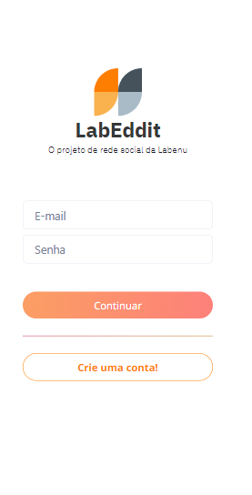

# LabEddit

## Table of contents

- [Overview](#overview)
  - [Features](#features)
  - [Preview](#preview)
  - [Demo](#demo)
  - [Sections](#sections)
- [Process](#process)
  - [Built with](#built-with)
- [Author](#author)

## :mega: Overview

- A project to my portfolio made based on a Social Media fullstack. See more below :)

### Features

- SignUp
- Login
- Post a message
- Post a comment in a message
- Edit/Delete your post
- See all posts

### Preview

### Demo

[Click here to see more](https://labeddit-rh.netlify.app/)

## :newspaper: Process

### Built with

- [React.Js](https://reactjs.org)

### :man: Author

<table>
  <tr>
    <td align="center">
      <a href="https://github.com/ruanHeleno">
          
         <b>Ruan Heleno</b> 
      </a>
    </td>
  </tr>
</table>

- [Portfolio](https://ruanheleno.github.io)
- [LinkedIn](https://www.linkedin.com/in/ruanheleno/)
